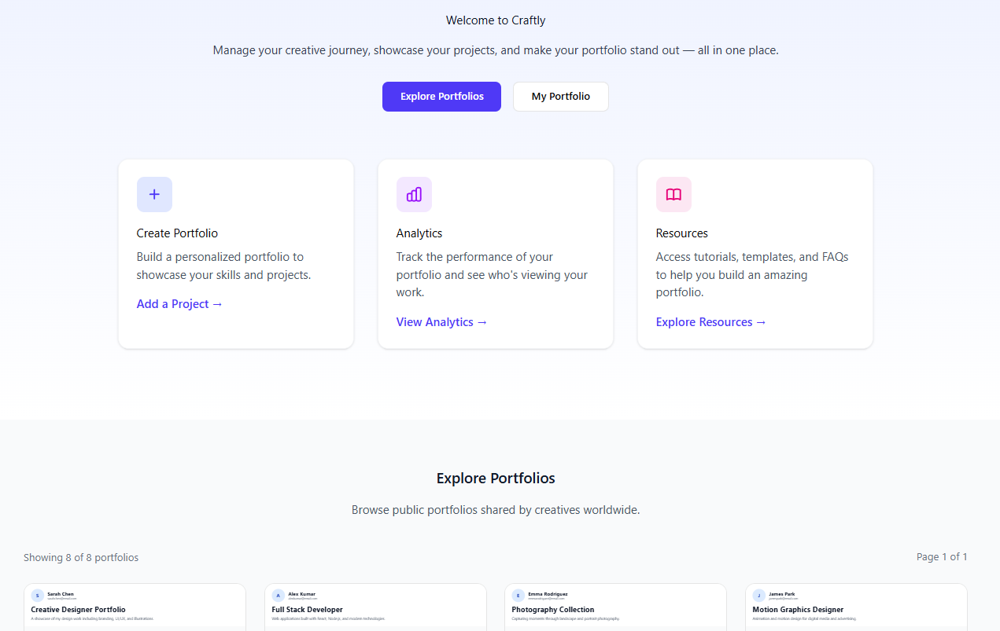

## Assignment – Landing Page Design Prototype

### Overview
As part of this assignment, a high-fidelity design prototype was created for the landing page of a web application using Figma. The landing page is designed to introduce the platform, communicate its purpose clearly, and encourage users to explore and create creative portfolios.

ChatGPT was used to assist in structuring the content and describing design requirements based strictly on the elements included in the prototype.

Link to Figma prototype:
https://grasp-truce-25647500.figma.site

---

## Page Purpose

The homepage is intended to:

- Clearly communicate the platform’s value proposition
- Encourage users to explore existing portfolios
- Invite users to create their own portfolio
- Present the platform as a central place for managing creative work

---

## Page Structure and Content

### Hero Section
The hero section introduces the platform and its core value.

Text content:
- Welcome to Craftly
- Manage your creative journey, showcase your projects, and make your portfolio stand out — all in one place.

Primary actions:
- Button: Explore Portfolios
- Button: My Portfolio

---

### Feature Cards Section
This section highlights the main platform actions through three cards.

Cards included:
- Create Portfolio
- Analytics
- Resources

Each card acts as a visual entry point to a core feature of the platform.

---

### Explore Portfolios Section
This section showcases examples of existing portfolios to inspire users.

Content:
- Section title: Explore Portfolios
- Grid layout with 8 portfolio examples

The section encourages browsing and discovery without requiring immediate interaction.

---

### Call-to-Action Footer Section
The footer functions as a final call to action.

Text content:
- Ready to showcase your work?
- Create your portfolio today and join thousands of creatives sharing their work.

Primary action:
- Button: Get Started

---

## Interaction and UX Considerations

- Clear visual hierarchy from hero section to final call to action
- Buttons used to guide user attention and actions
- Card-based layout for clarity and consistency
- Layout progression that naturally encourages scrolling

---

## Design Principles Applied (CRAP)

- Contrast: Clear separation between sections and emphasis on primary actions
- Repetition: Consistent use of buttons, cards, and spacing
- Alignment: Grid-based layout for portfolio examples and feature cards
- Proximity: Related elements grouped together to improve readability

---

## Accessibility Considerations

- Readable typography with sufficient contrast
- Clear button labels
- Logical content order for screen readers

---

## Deliverables

- High-fidelity Figma design prototype

Link to Figma prototype:
https://grasp-truce-25647500.figma.site